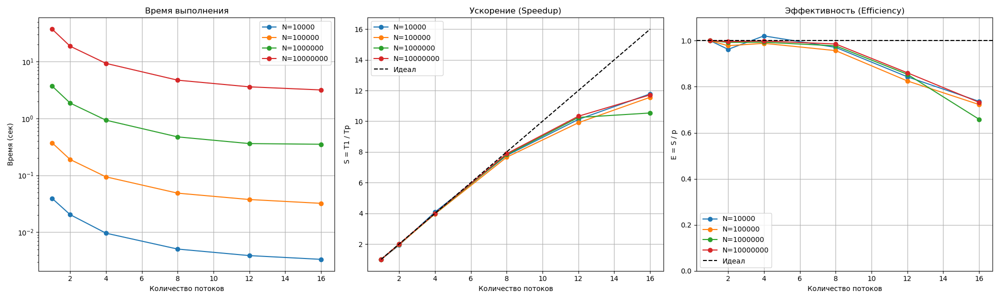
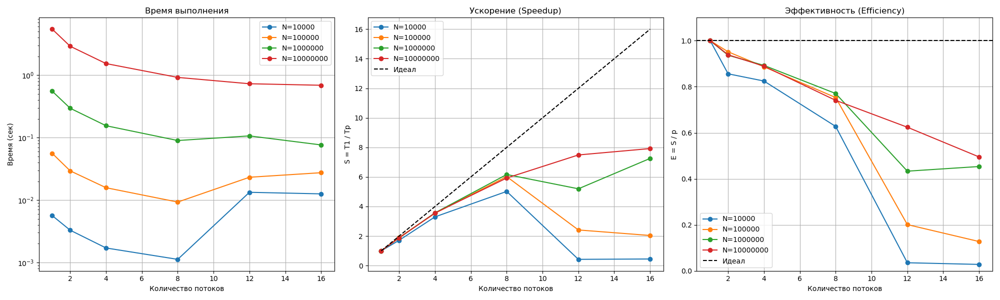
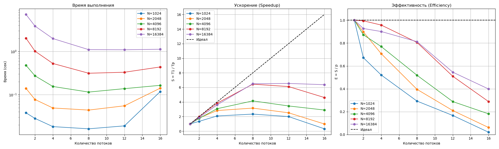

# Отчет по Лабораторной работе №2
**Параллельные вычисления: OpenMP, CUDA, Pthreads**

**Выполнили** студенты 22ПИ-2: Баранов Владислав, Лапшина Валерия, Сыров Вадим

---

## Содержание
1. [Аппаратное обеспечение и методика](#1-аппаратное-обеспечение-и-методика)
2. [Задание 1: Множество Мандельброта (OpenMP)](#2-задание-1-множество-мандельброта)
3. [Задание 2: Задача N тел (OpenMP vs CUDA)](#3-задание-2-задача-n-тел)
4. [Задание 3: RWLock (Pthreads)](#4-задание-3-реализация-rwlock)

---

## 1. Аппаратное обеспечение и методика

**Тестовая среда (CPU):**
*   **CPU:** AMD Ryzen 9 5980HX
*   **Ядра/Потоки:** 8 ядер / 16 потоков
*   **ОС:** Arch Linux (latest)
*   **Компилятор:** GCC (с поддержкой OpenMP)

**Тестовая среда (GPU):**
*   **GPU:** Nvidia Tesla T4 (Kaggle Environment)

**Методика замеров:**
*   Для измерения времени использовались функции `omp_get_wtime()` (OpenMP) и `gettimeofday` (Pthreads). Для CUDA замерялось полное время выполнения (`time` в bash), включая пересылку данных, так как сравнивается время работы всей программы ("Wall time").
*   Для исключения эффекта "холодного старта" (особенно на GPU) проводился прогревочный запуск.

---

## 2. Задание 1: Множество Мандельброта

### Постановка задачи
Требуется найти множество точек на комплексной плоскости (в диапазоне $x \in [-2, 1], y \in [-1.5, 1.5]$), для которых последовательность $z_{n+1} = z_n^2 + c$ остается ограниченной.

Реализованы два численных метода:
1.  **Monte-Carlo (Метод Монте-Карло):** Генерация $N$ случайных точек в заданной области. Каждая точка проверяется независимо. Этот метод позволяет оценить площадь множества статистически.
2.  **Grid Search (Поиск по сетке):** Область разбивается на равномерную сетку размером $\sqrt{N} \times \sqrt{N}$. Проверка осуществляется систематически для каждого узла сетки. Этот метод дает точную визуализацию множества (пикселизация).

### Реализация (OpenMP)
Для распараллеливания использована директива `#pragma omp parallel for`.

**Особенности реализации:**
*   **Балансировка нагрузки:** Вычисление принадлежности точки множеству занимает разное время (точки вне множества "вылетают" за пару итераций, точки внутри требуют проверки до `MAX_ITER`). Чтобы избежать простоя потоков, использовано динамическое планирование: `schedule(dynamic)`.
*   **Синхронизация записи:** Поскольку результаты сохраняются в плотный массив, для получения уникального индекса записи используется `#pragma omp atomic capture`.

### Результаты производительности

#### 1. Метод Монте-Карло


**Анализ метода Монте-Карло:**
*   **Масштабируемость:** На больших объемах данных ($N=10^7, 10^8$, красная и зеленая линии) метод демонстрирует отличную масштабируемость. Ускорение растет почти линейно вплоть до 16 потоков.
*   **Эффективность:** Для $N=10^8$ эффективность держится на уровне 0.7–0.8 даже на 16 потоках, что говорит о том, что вычислительная нагрузка значительно превышает накладные расходы на генерацию случайных чисел и синхронизацию.

#### 2. Метод Grid Search


**Анализ метода Grid Search:**
*   **Предел масштабируемости:** График ускорения показывает рост производительности только до **8 потоков**. При переходе к 12 и 16 потокам происходит резкое падение производительности (особенно заметно на синем и оранжевом графиках, где ускорение падает почти до нуля).
*   **Причины падения:** Вероятно, узким местом становится конкуренция за атомарную переменную (индекс массива результатов) и эффекты кэша, так как потоки пытаются писать в соседние ячейки памяти с высокой частотой. В отличие от Монте-Карло, где вычисления `rand_r` добавляют задержку между записями, в Grid Search точки обрабатываются очень быстро, создавая высокую нагрузку на шину памяти при записи результатов.
*   **Вывод:** Для данного алгоритма оптимальным является использование числа потоков, равного числу физических ядер (в данном случае восьми), дальнейшее увеличение потоков вредит производительности из-за синхронизации.

---

## 3. Задание 2: Задача N тел

### Постановка задачи
Моделирование гравитационного взаимодействия $N$ тел на плоскости (2D) в течение времени $T_{end}$.
Основная сложность задачи заключается в расчете сил притяжения, который требует вычисления $O(N^2)$ парных взаимодействий на каждом шаге по времени.

$$ \vec{F}_{i} = G \cdot m_i \sum_{j \neq i} \frac{m_j (\vec{r}_j - \vec{r}_i)}{|\vec{r}_j - \vec{r}_i|^3} $$

### 3.1. Реализация CPU (OpenMP)
Использован подход "каждый с каждым" с оптимизацией по **третьему закону Ньютона** ($\vec{F}_{ij} = -\vec{F}_{ji}$).
*   Внешний цикл по телам распараллелен с помощью `#pragma omp parallel for schedule(dynamic)`.
*   Чтобы избежать состояния гонки (Race Condition) при записи сил для пары тел (`force[i]` и `force[j]`), использована **редукция массива** (`reduction(+:fx, fy)`). Каждый поток накапливает силы в локальной копии массива, которые затем суммируются. Это требует дополнительной памяти $O(N \cdot Threads)$, но позволяет эффективно использовать все ядра.

### 3.2. Реализация GPU (CUDA)
Для реализации на GPU выбран алгоритм **Shared Memory Tiling** без использования третьего закона Ньютона.

**Почему не использован 3-й закон Ньютона?**
На GPU тысячи потоков работают одновременно. Попытка записать силу сразу в две ячейки (`force[i]` и `force[j]`) привела бы к массовым коллизиям памяти. Использование `atomicAdd` для решения этой проблемы на глобальной памяти слишком медленно и нивелирует выигрыш от сокращения числа операций. Поэтому каждый поток считает полную силу для своего тела, что идеально ложится на архитектуру SIMT (Single Instruction, Multiple Threads).

**Оптимизация Tiling:**
*   Глобальная память видеокарты имеет высокую латентность.
*   Координаты тел загружаются блоками ("плитками" по `BLOCK_SIZE` штук) в сверхбыструю **Shared Memory** внутри мультипроцессора.
*   Потоки синхронизируются через `__syncthreads()`, рассчитывают взаимодействие со всей плиткой, и затем загружают следующую. Это снижает трафик к глобальной памяти в разы.

```cpp
__global__ void calculate_forces(...) {
    __shared__ double sh_x[BLOCK_SIZE]; 
    // ...
    for (int tile = 0; tile < gridDim.x; tile++) {
        // Кооперативная загрузка плитки в Shared Memory
        sh_x[threadIdx.x] = d_x[idx]; 
        __syncthreads();
        
        // Быстрые вычисления внутри Shared Memory
        for (int j = 0; j < BLOCK_SIZE; j++) { 
            // Расчет взаимодействия без обращений к VRAM
        }
        __syncthreads();
    }
}
```

### Сравнение производительности (CPU vs GPU)

Замеры проводились для симуляции 10 шагов ($T_{end}=500, dt=50$) с обязательной записью координат всех тел в файл на каждом шаге.

| Кол-во тел (N) | CPU (16 threads) | GPU | Отношение (CPU/GPU) |
| :--- | :--- | :--- | :--- |
| **1024** | 0.017 s | 0.253 s | 0.06x |
| **4096** | 0.085 s | 0.438 s | 0.19x |
| **8192** | 0.274 s | 0.590 s | 0.46x |
| **16384** | **0.829 s** | **1.450 s** | **0.57x** |

*График масштабируемости OpenMP реализации:*


**Выводы по задаче 2:**
1.  **Потенциал GPU:** Несмотря на проигрыш в абсолютных числах на данном тесте, GPU демонстрирует мощную тенденцию к сокращению разрыва. При увеличении $N$ с 1024 до 16384 (рост вычислительной сложности в 256 раз), время выполнения на GPU выросло всего в 5.7 раз, в то время как на CPU — в 48 раз.
2.  **Фактор ввода-вывода (I/O Bound):** Основным "тормозом" для GPU стала необходимость копировать данные обратно на хост (`cudaMemcpy`) и писать их в файл на *каждом* шаге симуляции. Это убивает преимущества массового параллелизма GPU на коротких дистанциях.
3.  **Перспектива:** В реальных научных задачах, где число шагов исчисляется миллионами, а запись происходит редко, данная реализация на CUDA показала бы кратное превосходство над CPU, так как накладные расходы на запуск ядра и трансфер памяти стали бы пренебрежимо малы по сравнению с чистыми вычислениями $O(N^2)$.

---

## 4. Задание 3: Реализация RWLock

### Постановка задачи
Реализовать примитив синхронизации **Read-Write Lock** (блокировка чтения-записи), используя базовые примитивы: мьютексы и условные переменные (`pthread_cond`). Провести сравнение производительности с библиотечной реализацией `pthread_rwlock_t` на примере работы с односвязным списком.

### Детали реализации
В собственной реализации (`Custom`) выбрана стратегия **Writer Preference** (Приоритет писателя).
Это означает, что если поток-писатель запросил блокировку (увеличил счетчик `writers_waiting`), новые потоки-читатели блокируются и уходят в ожидание, даже если в данный момент другие читатели уже работают со списком.

Сравнение производилось со стандартной реализацией `pthread_rwlock_t` с настройками по умолчанию.

**Структура данных (`my_rwlock_t`):**
```c
typedef struct {
    pthread_mutex_t mutex;      // Защита внутренних полей
    pthread_cond_t read_cond;   // Ожидание для читателей
    pthread_cond_t write_cond;  // Ожидание для писателей
    int readers_active;         // Активные читатели
    int writers_waiting;        // Писатели в очереди (для реализации приоритета)
    int writer_active;          // Флаг активного писателя
} my_rwlock_t;
```

### Результаты производительности

Тестирование проводилось на списке (1000 элементов, 100 000 операций) в двух режимах:
1.  **Read-Heavy:** 90% `Member` (поиск), 5% `Insert`, 5% `Delete`.
2.  **Write-Heavy:** 50% `Member`, 25% `Insert`, 25% `Delete`.

**Таблица результатов (время в секундах):**

| Scenario | Threads | Custom RWLock | StdLib RWLock | Разница |
| :--- | :--- | :--- | :--- | :--- |
| **Read-Heavy** | 1 | 0.59 s | 0.57 s | StdLib быстрее на ~3% |
| **Read-Heavy** | 2 | 0.46 s | 0.52 s | Custom быстрее на 11% |
| **Read-Heavy** | 4 | 0.38 s | 0.57 s | Custom быстрее на 33% |
| **Read-Heavy** | 8 | **0.35 s** | 0.63 s | **Custom быстрее на 44%** |
| | | | | |
| **Write-Heavy** | 1 | 5.28 s | 5.12 s | StdLib быстрее на ~3% |
| **Write-Heavy** | 2 | 5.02 s | 6.02 s | Custom быстрее на 16% |
| **Write-Heavy** | 4 | 4.69 s | 6.38 s | Custom быстрее на 26% |
| **Write-Heavy** | 8 | **4.49 s** | 6.71 s | **Custom быстрее на 33%** |

**Анализ результатов:**

1.  **Однопоточный режим:**
    На 1 потоке стандартная библиотека (`StdLib`) работает немного быстрее. Это ожидаемо, так как `pthread_rwlock` оптимизирована и часто использует атомарные инструкции (futex) для "быстрого пути" без захвата полноценного мьютекса ядра, тогда как наша реализация (`Custom`) всегда захватывает `pthread_mutex` при входе и выходе.

2.  **Масштабируемость:**
    С увеличением числа потоков собственная реализация (`Custom`) показывает лучшую производительность в обоих сценариях.
    *   В **Read-Heavy** время выполнения `Custom` снижается с ростом потоков (с 0.59с до 0.35с), демонстрируя эффективное распараллеливание чтений. Стандартная библиотека, напротив, начинает замедляться после 2 потоков.
    *   В **Write-Heavy** (высокая конкуренция за запись) `Custom` реализация выигрывает более 2 секунд на 8 потоках (33% прироста).

3.  **Вывод:**
    Реализованная стратегия приоритета писателей (`Writer Preference`) оказалась более эффективной для данной задачи (работа со связным списком), чем стратегия по умолчанию стандартной библиотеки. Наша реализация быстрее передает управление писателям, уменьшая время ожидания в очередях при интенсивной нагрузке.